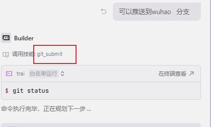

# 第2期：Skills 体系升级：目录结构、规则索引与提交工作流

这一期我们把 trai 从“随手放代码片段的小仓库”，往“可复用、可协作、可持续演进的工程沉淀库”推进了一步：核心是把 Skills（能力/规范）体系真正落地，让后续的代码变更有章可循、可自动拦截、可复盘。

## 这次更新做了什么

### 1. Skills 与 Rules：按域拆分，目录结构统一

过去当技能/规范散落在不同位置时，会遇到两个问题：
- 不知道从哪开始看
- 写着写着容易出现“同类规范多处拷贝、口径不一致”

这次我们统一把能力域拆成几个“可理解的盒子”，并保持结构一致：
- `agent`：通用 Agent 能力（上下文工程、工具治理、安全、审计、反馈、熵管理、媒体能力等）
- `backend`：后端规范与检查入口（DDD 分层、API/数据库/S3 等）
- `desktop_client`：桌面端（PyQt6）规范与检查入口（线程/Worker、防卡死、UI 设计等）
- `electron`：Electron 桌面端规范（TS、IPC 通道、窗口管理、自动更新与 S3 上传等）
- `frontend_next`：Next.js 前端规范（App Router、TS、Tailwind、i18n、目录组织等）
- `project`：项目级流程能力（命名、Changelog、提交推送、周报生成等）

同时，在两套常见的运行/编辑环境里都保持一致索引：
- `.trae/skills` 与 `.trae/rules`
- `.cursor/skills` 与 `.cursor/rules`

这样做的收益是：不管你在哪个环境里执行/查阅，都能用同一套“入口文件 + 领域目录”的方式快速定位规范。

### 2. agent 能力域补齐：把“会做”写成“可执行的规则”

这一期重点补齐了 agent 相关的能力文档，把隐性经验变成显性规则，覆盖方向包括：
- 媒体能力：音频/视频/图片/聊天等场景的上下文、规则与边界
- 安全与审计：日志、敏感信息、合规输出的约束
- 反馈闭环：用户反馈如何进入迭代、如何避免信息熵失控
- 工具治理：什么时候用工具、怎么用、怎么避免“乱跑命令”

目标很简单：把“能跑起来”升级为“稳定可控、能协作、能复用”。

### 3. 提交流程标准化：把“推送”变成一条可复现流水线

我们把“提交/推送”动作收敛到项目级能力中，形成统一的工作流（重点是可拦截、可追溯）：
- 先看改动范围：`git status`
- 再做规范拦截：根据改动模块自动触发对应领域检查
- 再补齐 Changelog：提交前把变更摘要写进 README 的更新日志顶部
- 再提交并推送：`add -> commit -> pull --rebase -> push`

这样带来的直接好处：
- PR/回滚/排查更容易：每次变更有明确的范围与摘要
- 多人协作不容易踩雷：减少“未更新日志就推送”“绕过规范就上线”的概率

## Trae 实战：一键提交与推送（git_submit）

这一期我们把这套流程真正跑起来了：目前用 Trae 作为开发环境，通过 Skills 把“日常提交”变成可复现的自动化步骤。

你只需要一句“推送到 wuhao 分支”，后面会按既定规则串起来：
- 先 `git status` 明确改动范围，避免“改了啥自己都不清楚就推”
- 再检查是否需要更新 README 的 Changelog（要求把摘要追加到顶部，保持时间倒序）
- 再用中文生成提交信息（例如 `docs:` / `feat:` / `fix:` 等前缀），保证协作可读
- 最后执行 `pull --rebase` 并推送到目标分支

这不是为了“省一步命令”，而是为了把团队习惯写进流程里：让每一次提交都有记录、有摘要、有约束。

