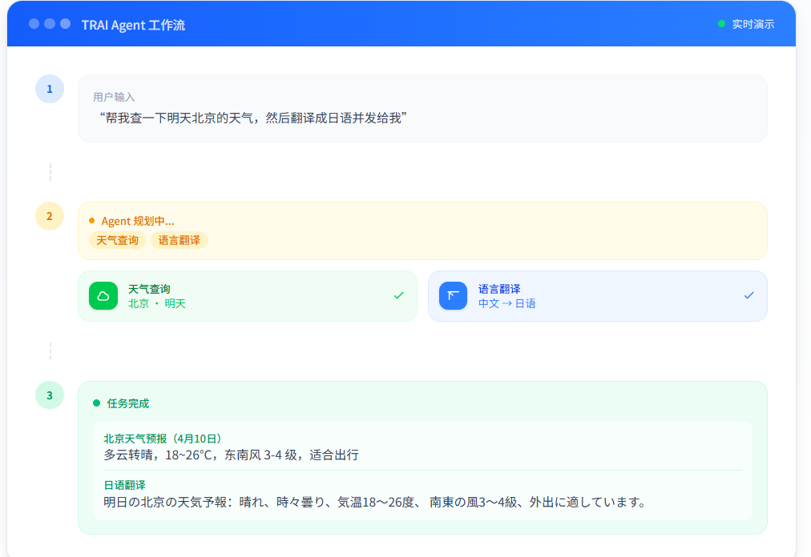

# TRAI 第3期：Agent 工具与工作流落地，前后端与 Skills 一起往前走

  <strong>本期一句话</strong>：把「能对话的 API」推进到「能规划、能调工具、能治理、能看得见」——后端串起认证、流式、限流审计与 Agent 全链路；前端补齐官网、管理后台与对话里的工具反馈；Skills 继续把论文与工程约束写成可执行规则。

  <strong>时间锚点</strong> <code style="background:#e2e8f0;padding:2px 6px;border-radius:4px;color:#0f172a;">md/issue_02/index.md</code> 最后入库：<code style="background:#e2e8f0;padding:2px 6px;border-radius:4px;color:#0f172a;">5eacf2a</code> · 2026-04-09 10:45:58 +0800 · 本期范围 <code style="background:#e2e8f0;padding:2px 6px;border-radius:4px;color:#0f172a;">git log 5eacf2a..HEAD</code>

  <strong style="color:#1d4ed8;">预览配色</strong>：彩色块写法与 <code>.cursor/skills/project/SKILL.md</code> 一致，使用内联 <code>style</code>，避免在 <code>&lt;div&gt;</code> 开头与正文之间插入<strong>空行</strong>（否则预览会把 <code>&lt;/div&gt;</code> 当成普通文字）。可选：配 <code>markdown.styles</code> 加载 <code>md/issue_docs.css</code> 作 class 方案。

## 这次更新做了什么

  
后端 · Agent 链路

  
认证、会话、AI、媒体、健康检查 → SSE 与遥测、限流、审计 → PolicyEngine、Token、配额、执行器、工具集、企微通讯录工具。

  
前端 · 三入口

  
官网营销页、管理后台多页骨架、Agent 对话（流式 + 工具卡片）。Indigo 主色，禁止紫色写进 Skills。

  
Skills · 可执行

  
Harness 可观测性进技能；跨端配色禁令；<code>.cursor/rules</code> 与文档并行索引。

### 1. 后端：从「有接口」到「能跑通一条 Agent 链路」

  <strong style="color:#0e7490;">主线</strong>：JWT 与用户仓储 → 会话与消息 → AI 绘图与上传 → 库表初始化与健康/通知 → <strong>发消息联动模型 + SSE</strong> → OpenTelemetry、限流、审计中间件 → <strong>PolicyEngine / Context / Quota / Executor / 纠错 / 天气·搜索·翻译·计算·企微</strong>。

**基础层**（上一期之后新增）：认证（JWT、密码、用户仓储）、会话与消息、AI 对话与绘图、媒体上传、数据库初始化与健康检查、通知入口。

**治理闭环**（衔接基础层）：会话发消息与流式 SSE 联动模型、OpenTelemetry 追踪钩子、限流与审计中间件——把执行、治理、评测三条在代码里先「能接上」。

**Agent 深化**（本期最大一块）：PolicyEngine（允许 / 拒绝 / 需确认）、Token 计数与上下文裁剪、配额服务与多张业务表对应的仓储、Agent 执行器配合错误分类与自我纠错、内置天气 / 搜索 / 翻译 / 计算等工具，以及企业微信通讯录查询工具类接入工具加载器。

这些拼在一起，才称得上「一条可演示的 Agent 链路」。

### 2. 前端：从 TODO 看板扩到官网、管理后台与 Agent 对话页

  <strong style="color:#047857;">三个入口并行长出来</strong>：官网首屏与版块节奏、B 端侧栏与多页骨架、对话区工具反馈与 indigo 色系规范——均已与 <code>frontend_next</code> Skills 对齐。

- **官网**：能力、数据、场景、架构、FAQ 的完整营销页。  
- **管理后台**：仪表盘与用户、分析、监控、配额等骨架，侧栏导航体验。  
- **Agent 页**：流式打字感 + 工具执行状态卡，让用户看见系统在调什么工具。

### 3. Skills 与 Rules：论文进技能，约束进索引

  按域拆分（agent / backend / frontend_next / desktop_client / electron / project）已固定。本期新增：Agent Harness 可观测性要求写入技能说明，跨端配色禁令落到对应 SKILL，<code>.cursor/rules</code> 与仓库内文档并行索引。

### 4. 工程与协作：提交习惯仍在延长线

`git_submit` 等流程仍适用：范围 → Changelog → 中文提交说明 → rebase 推送。主干上可见 `feat(backend)`、`feat(agent)`、`docs(agent)` 等与上述能力对应的提交。

## 实战示意：工具调用（单轮可见）

  
&#10060; 产品要点

  
用户必须能区分「模型在说话」和「系统在调工具」。截图里用绿色节点标出 <code>工具调用: weather / translate</code>，与遥测里的 <code>tool_name</code>、耗时同一语义的两面展示。

## 实战示意：多步工作流（规划与串联）

用户一句复杂需求往往包含多个子意图。「TRAI Agent 工作流」把过程拆成：

  <ol style="margin:0;padding-left:1.3em;font-size:0.92em;color:#334155;line-height:1.8;">
    <li>用户一句话输入</li>
    <li>Agent 识别需要天气与翻译</li>
    <li>两步工具卡片分别完成</li>
    <li>最后合成答复返回用户</li>
  </ol>

## 本期 Git 摘要（按主题）

| 主题 | 内容要点 |
|------|----------|
| 底座与配置 | 后端初始化、`.env.example`、忽略规则、DDD 路径整理 |
| 认证与用户 | 安全模块、认证路由、用户模型与仓储、初始化脚本 |
| 业务 API | 会话、AI、媒体、健康与监控、通知 |
| 可观测与治理 | SSE、遥测、限流、审计、中间件顺序 |
| Agent 深化 | 策略、Token、配额、纠错、工具集、企微、管理端 |
| 前端 | 官网、后台、Agent 与认证页、样式与文案 |
| 文档与技能 | Harness、issue 配图、本期锚点说明 |

## 下一步方向

  <strong style="color:#1d4ed8;">续写第 4 期时</strong>：用 <code>git log -1 -- md/issue_03/index.md</code> 取本期入库提交作新锚点，再拉 <code>git log</code> 写 <code>md/issue_04/index.md</code>。详见 <code>.cursor/skills/project/issue_index/SKILL.md</code>。

- 管理后台与仪表盘从 Mock 切真实接口，统一错误与空状态文案。  
- 外链会话、企微部门同步与本地缓存等议题放入下一期叙事。  
- 评测接入 Langfuse 等时，在 `issue_04` 单列环境与验收口径。

---

  <em>编写说明：本期依据 <code style="background:#e2e8f0;padding:2px 6px;border-radius:4px;color:#0f172a;">git log</code> 自 <code style="background:#e2e8f0;padding:2px 6px;border-radius:4px;color:#0f172a;">md/issue_02/index.md</code> 最后入库提交起算；可选样式表见 <code style="background:#e2e8f0;padding:2px 6px;border-radius:4px;color:#0f172a;">md/issue_docs.css</code>。</em>

