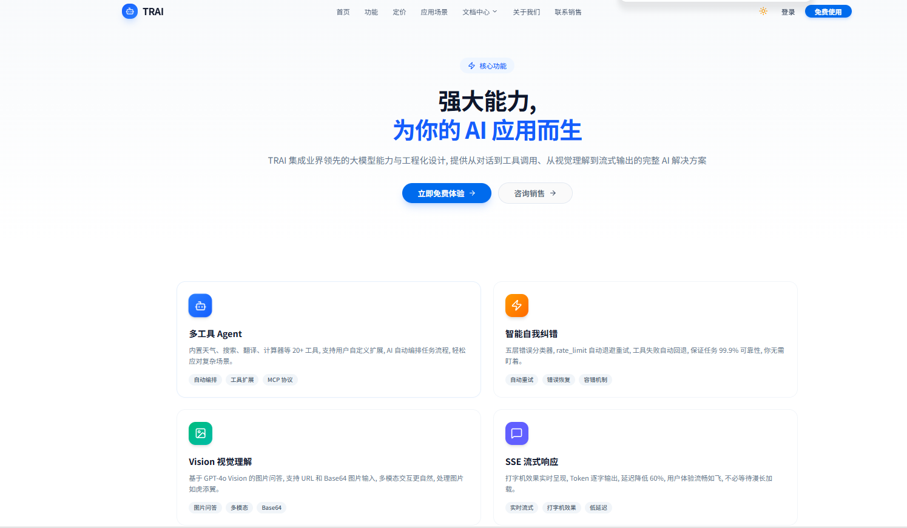
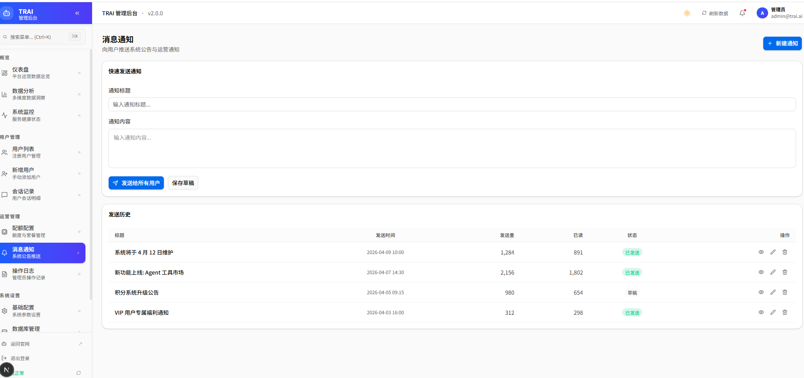
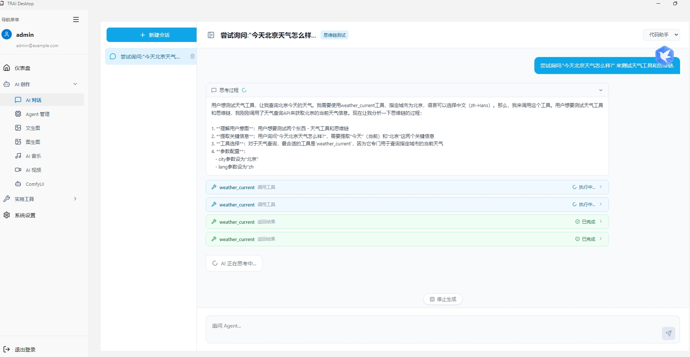
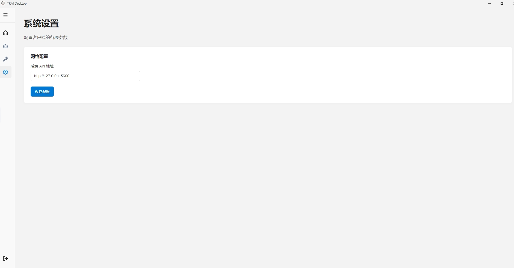

# TRAI 第4期：Electron 客户端重生，思维链 (CoT) 落地与全栈大整合

  <strong>本期一句话</strong>：桌面端抛弃 PyQt6 彻底拥抱 Electron，带来原生流畅的 Win11 Fluent 体验与深度的 Agent 思维链 (CoT) 交互展示；同时，前端官网完成“全宽重构”，管理后台修复水合报错并打通动态关系图谱；后端进一步扩容了从图片压缩到 ComfyUI 的完整工具与能力链。

  <strong>时间锚点</strong> <code style="background:#e2e8f0;padding:2px 6px;border-radius:4px;color:#0f172a;">md/issue_03/index.md</code> 最后入库：<code style="background:#e2e8f0;padding:2px 6px;border-radius:4px;color:#0f172a;">3a19c46</code> · 2026-04-10 17:21:53 +0800 · 本期范围 <code style="background:#e2e8f0;padding:2px 6px;border-radius:4px;color:#0f172a;">git log 3a19c46..HEAD</code>

## 这次更新做了什么

  
客户端 · Electron 架构与思维链 (CoT)

  
将老旧的 <code>desktop_client</code> (PyQt6) 整体重构为 <code>client_electron</code>，实现 Win11 Fluent Design、系统托盘、多窗口管理与本地持久化配置；对话界面深度支持 DeepSeek 流式响应、Markdown 渲染与核心的 <strong>思维链 (CoT) 加载状态</strong>，让 Agent 的思考过程完全透明。

  
前端官网与后台 · 视觉扩展与动态交互

  
官网首屏及周边营销页从 <code>max-w-4xl</code> 升级至 <code>max-w-7xl</code> 全宽大屏视觉，并进行企业名脱敏；管理后台彻底修复 React Hydration 报错，上线基于真实 Git 提交的动态路线图与 FE/BE/CL 多端关系联动图谱。

  
后端与工具库 · AI 生态扩容与极度代码洁癖

  
后端接入多 Agent 注册模块，打通 ComfyUI 及多模态（音视频）底层路由；新增包含目标体积压缩与尺寸裁剪的图片转换工具；规范层面落地了极其严苛的「中文全角标点禁令」与 <code>ruff_check</code> 自动化拦截。

### 1. 客户端：重铸桌面交互与思维链 (CoT) 体验

  <strong style="color:#0e7490;">主线</strong>：抛弃历史包袱，在 Electron 环境下重新长出登录、对话、工具箱与系统设置。重点攻克模型长思考与流式输出的体验问题。

**Electron 架构底座**：
- 完成从 PyQt6 到 Vite + React + Electron 的大迁徙，并启用了原生感更强的 Win11 亮色主题。
- 实现了系统托盘常驻、单例应用锁（防止多开），以及 `config_store` 的本地持久化存储机制。

**对话页与思维链测试**：
- 引入了 Agent 选择器，支持切换包括魔塔 Qwen3.5-0.8B 等多个测试模型。
- **思维链体验**：针对复杂模型（如 DeepSeek），我们在对话气泡上方增加了带有动画反馈的“思考过程”折叠面板（CoT）。用户可以清晰地看到大模型在输出最终答案前，内心推演的逻辑链条。
- **阅读优化**：支持流式打字机效果、实时 Markdown 渲染，并为超长回复与代码块加入了自动折叠/展开功能。

**系统配置与工具箱**：
- 初步搭建了客户端「系统设置」界面，支持深浅色切换、网络代理、基础账号信息等（后期会补充更多高级配置）。
- 工具箱页面升级为卡片式布局，不仅接入了图片转换，还预留了 MD转PDF 等多个实用小工具的入口。

### 2. 前端：从官网全宽视觉到 B 端后台的骨架完善

  <strong style="color:#047857;">官网张力与后台修复</strong>：将 C 端营销页的视觉边界打开，同时把 B 端管理面板里那些恼人的技术债（水合报错、接口断连）彻底还清。

**全宽视觉与合规**：
- 首页、Features、Pricing 等页面全部抛弃 `max-w-4xl` 的窄边限制，铺开到 `max-w-7xl`。
- 同步对“字X跳动”、“华X”等测试数据进行脱敏打码，规避侵权。

**Hydration 痛点与交互**：
- 在 `/admin` 路由组引入 `mounted` 状态管理，完美解决 Next.js 服务端 HTML 与客户端本地状态（Theme、Token）不一致导致的 React Hydration 崩溃。
- 左侧菜单现已支持流畅展开折叠，并且整个前端（包括官网和管理后台）完美支持**深色/浅色（Dark/Light）主题自由切换**，解决了切换时的闪烁与断层现象。

**动态路线图与三域联动**：
- `/roadmap` 页面摒弃静态写死的时间轴，直接读取仓库真实 Git 日志生成线性时间段。
- 在下方创新加入了 **前端(FE) / 后端(BE) / 客户端(CL)** 三域关系图谱，点击即可过滤出当天的多端联动变更。

### 3. 后端生态：工具链扩建与强悍的代码“洁癖”

  <strong style="color:#4c1d95;">后端基建与规范</strong>：不仅要接得进更多大模型玩法，更要用严苛的工具把后端代码管得干干净净。

- **多模态与工具生态**：
  - 补充了 AI 音乐、视频等生成式入口的前端骨架。
  - 新增图片格式互相转换核心工具（支持 PNG/JPEG/ICO/WEBP），甚至支持用户在前端指定“目标压缩体积(KB)”或“无损打包多尺寸 ICO”。
- **极端代码规范落地**：
  - 强制执行「全局中文标点符号禁令」，全站排查并清除了所有违规的全角逗号、句号。
  - 在 `git_submit` 技能中嵌入 `ruff_check`，提交代码前自动格式化 Python 导入路径并拦截语法坏味道。
  - 对数据库层新增了强制 `COMMENT` 注释检查脚本，为表字段生成自动化文档兜底。

## 实战示意：官网与全宽视觉重构

  
&#10060; 产品要点

  
摒弃 <code>max-w-4xl</code> 的窄边距限制，使用 <code>max-w-7xl</code> 将视野彻底打开，配合深浅色自适应组件，呈现出现代化的 SaaS 官网质感。

## 实战示意：后台管理面板与多端联动

  

    侧边栏支持平滑折叠，右侧消息列表解决 Hydration 服务端/客户端渲染冲突；同时路线图下方新增 FE / BE / CL 多端代码联动图谱，展示开发链路。
  

## 实战示意：客户端对话的思维链测试 (CoT)

  
&#10060; 产品要点

  
在复杂推理场景下，将大模型的推理链路（如 DeepSeek）实时暴露给用户，上方展示带动画的折叠态“思考过程”，下方以 Markdown 流式渲染最终答案。

## 实战示意：客户端系统设置

  

    采用 Win11 亮色主题，补充了本地持久化的系统设置入口，后期将承载更多环境、网络及多 Agent 切换的高级配置项。
  

## 本期 Git 摘要（按主题）

| 主题 | 内容要点 |
|------|----------|
| 客户端重构 | PyQt6 整体迁移至 Vite + React + Electron，系统托盘与持久化存储 |
| 对话与 AI | 思维链 (CoT) 展示面板、流式 Markdown 渲染、长回复/长文本折叠 |
| 工具与生态 | ComfyUI 及多模态接口搭建、图片格式互相转换（支持指定体积压缩与 ICO） |
| 前端官网 | 全宽视觉重构、企业名打码合规化、深浅色模式平滑切换 |
| 前端后台 | React Hydration 渲染修复、动态路线图重构、FE/BE/CL 三域联动关系图谱 |
| 工程与规范 | `ruff_check` 自动格式化拦截、强制中文标点禁令、数据库 `COMMENT` 校验 |

## 下一步方向

  <strong style="color:#1d4ed8;">TRAI 第 5 期剧透</strong>：完善第三方身份认证与基础业务场景落地。

- **企业微信登录接入**：前端与官网将支持**企业微信（WeCom）扫码与网页登录**，打通第三方账号认证闭环。
- **官网版块深化**：补充和完善 TRAI 官网的更多业务场景展示与文档支持。
- **Agent 与客户端进阶**：进一步丰富客户端的高级配置项，深化工作流的可视化编排反馈。

---

  <em>编写说明：本期依据 <code style="background:#e2e8f0;padding:2px 6px;border-radius:4px;color:#0f172a;">git log</code> 自 <code style="background:#e2e8f0;padding:2px 6px;border-radius:4px;color:#0f172a;">md/issue_03/index.md</code> 最后入库提交起算；可选样式表见 <code style="background:#e2e8f0;padding:2px 6px;border-radius:4px;color:#0f172a;">md/issue_docs.css</code>。</em>

