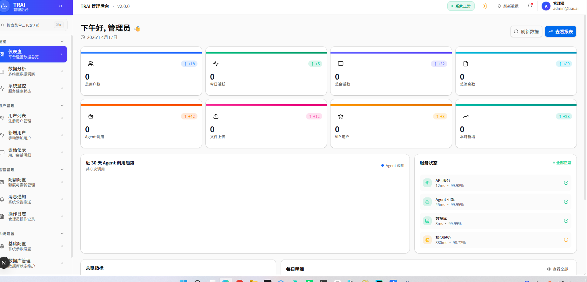
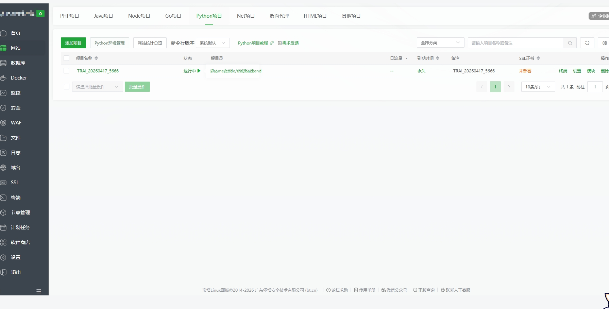
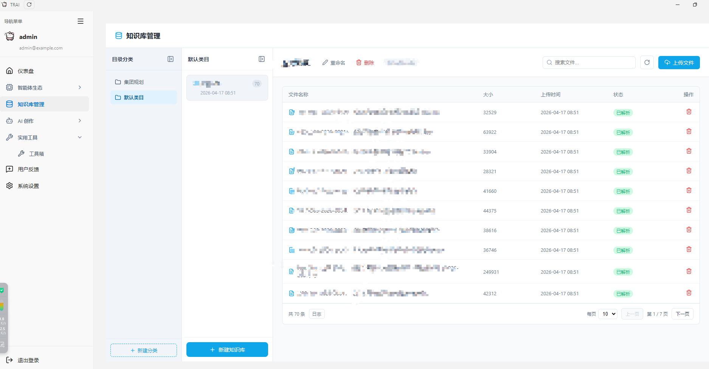

# TRAI 第5期: 管理后台落地, 环境搭建, 知识库能力闭环

  <strong>本期一句话</strong>: 管理后台与客户端能力持续补齐, 知识库从接口到分页体验打通, 同步沉淀一套环境部署与发布更新的文档化流程.

  <strong>时间锚点</strong> <code style="background:#e2e8f0;padding:2px 6px;border-radius:4px;color:#0f172a;">md/issue_04/index.md</code> 最后入库: <code style="background:#e2e8f0;padding:2px 6px;border-radius:4px;color:#0f172a;">d93802b</code> · 2026-04-14 17:18:59 +0800 · 本期范围 <code style="background:#e2e8f0;padding:2px 6px;border-radius:4px;color:#0f172a;">git log d93802b..HEAD</code>

## 这次更新做了什么

  
客户端 · 知识库能力闭环

  
文件列表从假数据切到真实接口, 分页与翻页状态修复, 新建知识库增加创建中提示, 让知识库管理从可用变成好用.

  
后端 · 百炼知识库分页与 total 修复

  
修复分页接口 total 误判导致的客户端分页置灰, 支持稳定翻到第 N 页. 同步补齐审计脱敏与 OpenAPI 中文化, 方便排查和交付.

  
前端后台 · 稳定性修复

  
修复管理后台下拉菜单 Label 组件的 Group 上下文缺失问题, 避免运行时直接报错导致页面不可用.

## 1. 前端后台管理系统搭建

  <strong style="color:#047857;">核心点</strong>: 先让后台稳定跑起来, 再谈功能扩展. 本期把一个会导致页面崩溃的下拉菜单分组问题修掉了.

## 2. 宝塔搭建与环境部署流程

  <strong style="color:#1d4ed8;">核心点</strong>: 环境搭建要可复用, 发布流程要可复现. 所以除了搭建过程, 我们也把 Electron 的打包与版本更新流程迁移到 skills 文档, 清理仓库临时脚本.

## 3. 客户端知识库搭建与体验闭环

  
为什么要写这一段

  
用户侧看到的是分页按钮能不能点, 能不能翻到第二页. 这背后同时依赖后端 total 计算和客户端页码状态管理, 任意一端不对都会让体验崩掉.

本期围绕知识库做了几件关键事:

- 客户端文件列表切服务端分页, 修复页码被 metadata 更新重置的问题
- 后端分页接口返回正确 total, 避免总数被误判为 page_size
- 新建知识库增加创建中加载提示, 避免用户误以为卡死
- 登录默认配置与错误提示优化, 方便本地与交付测试

## 本期 Git 摘要(截取关键提交)

| 类别 | 代表提交 |
|------|----------|
| 知识库分页与体验 | `00e53b0` `e2edece` `7dfd554` |
| 知识库对话联动 | `71a5b1c` `0890d60` `b52ca06` |
| OpenAPI 与审计 | `0d28924` `03275fd` `84bb83b` |
| 文档与规范清理 | `fb27e43` `acf0518` |

## 下一步计划

- 管理后台补齐更多核心页面, 同步完善权限与审计链路
- 客户端知识库补齐更多文件类型与状态同步能力, 提升可观测性
- 部署流程固化为可重复执行的脚本与文档, 降低交付成本
