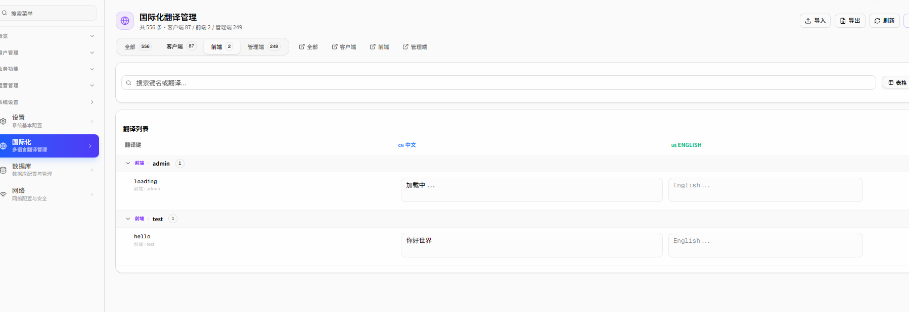
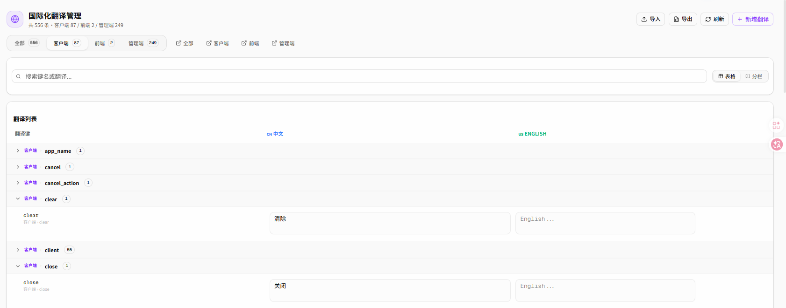
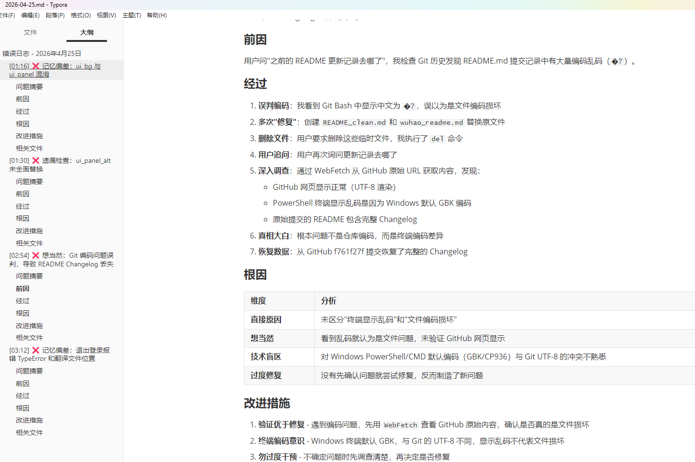
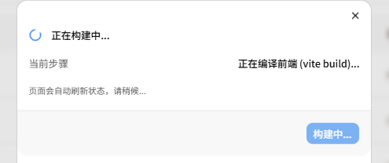
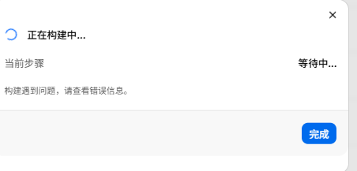
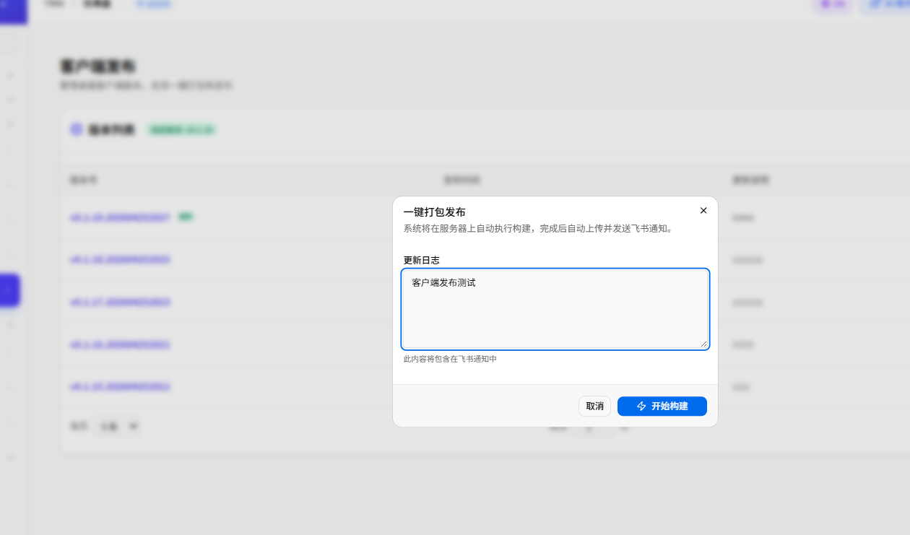
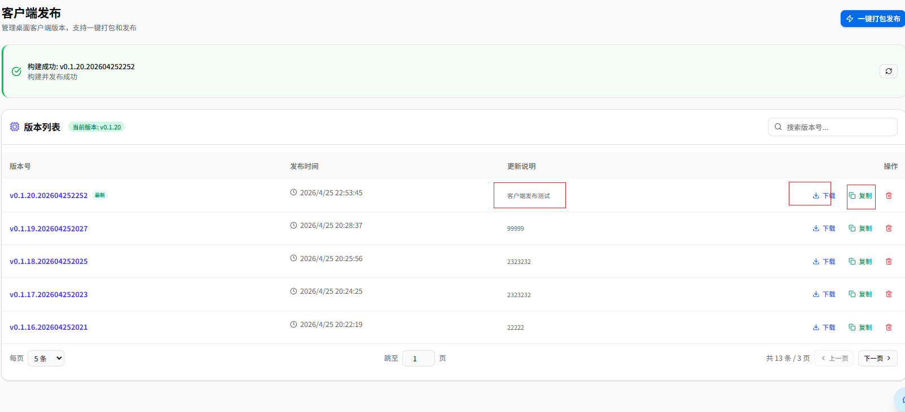
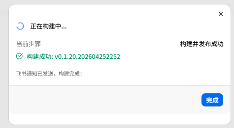
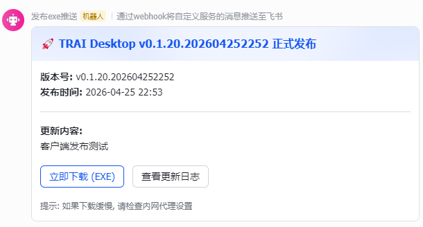

# TRAI 第7期: 国际化稳定性修复, README 编码治理, Skills 规范深化, 客户端交互完善

  <strong>本期一句话</strong>: 聚焦国际化系统稳定性，修复前后端键不匹配、命名空间解析逻辑、中英文切换持久化等核心缺陷；批量解决 README 文件 UTF-8 BOM 编码问题；深化 Skills 代码规范，强制禁止单字母变量名；完善客户端退出登录流程与动画反馈。

  <strong>时间锚点</strong> <code style="background:#e2e8f0;padding:2px 6px;border-radius:4px;color:#0f172a;">md/issue_06/index.md</code> 最后入库: <code style="background:#e2e8f0;padding:2px 6px;border-radius:4px;color:#0f172a;">e7f85954</code> · 2026-04-24 17:22:32 +0800 · 本期范围 <code style="background:#e2e8f0;padding:2px 6px;border-radius:4px;color:#0f172a;">git log e7f85954..HEAD</code>

---

## 1. 国际化 (i18n) 系统稳定性修复

  <strong style="color:#0369a1;">核心目标</strong>: 解决第6期 i18n 落地后的关键缺陷，确保翻译系统稳定可靠运行。

### 1.1 前后端翻译键不匹配

  <code style="background:#e0f2fe;padding:1px 5px;border-radius:3px;">根因</code> 前后端各自维护翻译键，缺乏统一协调导致前端 key 与数据库 key 不一致。

- 拆分 `init_i18n_frontend.py` 前端翻译初始化脚本，与后端脚本职责分离
- 拆分 `init_i18n_client.py` 客户端翻译初始化脚本，避免交叉污染
- 确保前端 key（如 `admin.dashboard.greeting.afternoon`）能正确同步到数据库

### 1.2 命名空间解析逻辑修复

  <code style="background:#ffedd5;padding:1px 5px;border-radius:3px;">Bug</code> loadNamespace 存储的 key 格式与 translate 调用格式不匹配，导致翻译失效。

- `FrontendI18nInit` 和 `ClientI18nInit` 修复 namespace 解析逻辑，从 key 中正确提取 namespace 存储到数据库
- 修复 loadNamespace 存储 key 格式从 `key` 改为 `namespace.key`，与 translate 调用格式对齐
- 为所有管理后台页面统一添加 `loadNamespace('admin')` 调用，确保每个页面都能正确加载翻译

  

    
国际化翻译展开

    
  

  

    
国际化翻译分类

    
  

### 1.3 数据库连接泄漏修复

  <code style="background:#fee2e2;padding:1px 5px;border-radius:3px;">隐患</code> 初始化脚本在异常路径下 session 未正确关闭，导致数据库连接泄漏。

- 所有脚本添加 `session.close()` 和 `session.rollback()` 保证连接释放
- 修复 i18n 初始化脚本的数据库连接管理

### 1.4 管理员语言持久化

  <code style="background:#dcfce7;padding:1px 5px;border-radius:3px;">体验</code> 修复管理员登录后中英文切换无效，语言偏好无法持久化。

- 管理员登录后默认设置为中文（`locale: "zh"`）
- 登录后语言偏好持久化到用户配置，后续访问保持一致

### 1.5 客户端翻译改为 API 获取

  <code style="background:#f3e8ff;padding:1px 5px;border-radius:3px;">架构</code> 移除客户端本地翻译文件，改为后端统一 API 驱动，实现一处修改全局生效。

- 移除 `client_electron/src/renderer/i18n.ts` 本地翻译文件
- 客户端翻译数据通过后端 `/i18n/client` 接口获取
- 支持中英文动态切换，无需更新客户端代码

---

## 2. README 编码治理

  <strong style="color:#b45309;">问题背景</strong>: README.md 在编辑过程中被加入了 UTF-8 BOM（`EF BB BF`），导致 GitHub 网页渲染出现乱码。

### 2.1 问题根源

  <code style="background:#ffedd5;padding:1px 5px;border-radius:3px;">编码</code> UTF-8 BOM 是文件开头的 3 字节标识，部分编辑器会无意间添加，GitHub Markdown 渲染器无法正确处理。

README.md 因含 BOM 导致 GitHub 渲染异常，部分内容显示为乱码或无法渲染。

### 2.2 修复方案

  <code style="background:#d1fae5;padding:1px 5px;border-radius:3px;">修复</code> 多轮替换损坏文件，统一使用纯 UTF-8 无 BOM 编码，移除合并冲突标记。

- 移除 README.md 的 UTF-8 BOM，使用纯 UTF-8 无 BOM 编码
- 替换损坏的 README.md 为正确编码版本（经过多轮重建才完全恢复）
- 移除 README.md 中的合并冲突标记（`<<<<<<< HEAD` 等）

### 2.3 预防措施

  <code style="background:#dbeafe;padding:1px 5px;border-radius:3px;">规范</code> 新增 `git_submit` 技能：提交前必须执行编码检查，禁止提交包含乱码的文件。

- 新增 `git_submit` 技能规范：提交前必须执行编码检查
- 读取所有修改的 .md 文件检查是否有 `???`、`?`、`�` 等乱码字符
- 如有乱码必须修复后再提交，禁止提交包含乱码的文件

---

## 3. Skills 代码规范深化

  <strong style="color:#4c1d95;">质量强制规范</strong>: 把工程经验固化为可执行的规则，减少同类问题重复出现。

### 3.1 禁止单字母变量名

  <code style="background:#f3e8ff;padding:1px 5px;border-radius:3px;">强制</code> 单字母变量名（t、e、i）严重影响可读性，必须替换为语义化名称。

上一期发现前端代码中存在大量单字母变量名（如 `t`、`e`、`i`），影响可读性和维护性。本期强制执行以下规范：

| 场景 | 禁止 | 正确 |
|------|------|------|
| 翻译函数 | `const t = useI18n()` | `const translate = useI18n()` |
| 表单事件 | `onClick={(e) => ...}` | `onClick={(click_event) => ...}` |
| 定时器 | `const t = setTimeout(...)` | `const login_timer = setTimeout(...)` |
| 循环变量 | `arr.map(i => ...)` | `arr.map(item => ...)` |

同时禁止与关键字/全局对象冲突的变量名：`now`、`Date`、`time`、`store`、`utils` 等。

### 3.2 Commit 消息格式规范化

  <code style="background:#dcfce7;padding:1px 5px;border-radius:3px;">格式</code> 统一 Commit 消息格式为：中文类型前缀 + 领域标签 + 描述。

- 类型前缀：`新增`、`修复`、`优化`、`文档`、`重构`、`测试`、`杂项` 等
- 领域标签：`<类型>（后端）` `<类型>（前端）` `<类型>（客户端）` `<类型>（桌面）` `<类型>（技能）` `<类型>（文档）` `<类型>（项目）`
- 示例：`界面（前端）为 admin/ai 页面补充完整的中英文翻译 keys`

### 3.3 提交前必须获取真实时间戳

  <code style="background:#fee2e2;padding:1px 5px;border-radius:3px;">时间戳</code> 禁止估算、禁止使用预估值，必须使用当前真实时间。

- Windows PowerShell: `Get-Date -Format "yyyy_MM_dd_HHmm"`
- Linux/Mac: `date +%Y_%m_%d_%H%M`
- 格式示例：`### 前端_2026_04_25_2247`

### 3.4 推送后自动切换回 wuhao 分支

  <code style="background:#e0f2fe;padding:1px 5px;border-radius:3px;">分支</code> 无论推送到哪个分支，完成后必须自动切换回 wuhao，确保工作目录始终回到个人分支。

根据 `git_submit` 技能规范，无论推送到哪个分支，完成后必须自动切换回 `wuhao` 分支：

- 推送完成后执行 `git checkout wuhao`
- 确保工作目录始终回到个人分支，避免在其他分支上意外开发

---

## 4. 错误日志模块建立

  <strong style="color:#15803d;">可追溯性提升</strong>: 建立错误日志记录机制，便于问题复盘和经验沉淀。

### 4.1 错误日志目录结构

  <code>md/error_logs/</code> 
  <code style="padding-left:16px;">2026_W17/</code> 
  <code style="padding-left:32px;">├── README.md</code> 
  <code style="padding-left:32px;">└── 2026-04-25.md</code>

按周组织错误日志，每周一更新目录结构，记录本周内遇到的关键错误及解决方案。

### 4.2 记录内容

  
错误日志记录

  

  

    <strong style="color:#c2410c;">退出登录报错</strong> axios 拦截器日志缺失、animate-spin 类名问题
  

  

    <strong style="color:#0369a1;">翻译文件移除</strong> 本地翻译文件删除后导致的运行时错误
  

  

    <strong style="color:#4c1d95;">编码误判</strong> Git 编码误判导致 README Changelog 丢失的复盘
  

---

## 5. 客户端退出登录与国际化改造

  <strong style="color:#be123c;">退出流程重构</strong>: 修复退出登录报错问题，完善交互体验和动画反馈。

### 5.1 退出登录报错修复

  <code style="background:#fee2e2;padding:1px 5px;border-radius:3px;">Bug</code> 退出登录时出现报错，影响用户体验和网络排查。

- 修复 axios 拦截器添加日志，便于排查网络问题
- 替换 `animate-spin` 为 `anim_spin` 解决动画类名问题
- 修复登录路由、退出弹框与退出动画的完整流程

### 5.2 客户端国际化改造

  <code style="background:#f3e8ff;padding:1px 5px;border-radius:3px;">架构</code> 删除本地翻译文件，翻译数据统一从后端 API 获取，实现一处修改全局生效。

移除客户端本地翻译文件，改为后端统一 API 驱动：

- 删除 `client_electron/src/renderer/i18n.ts` 本地翻译
- 客户端翻译数据通过后端 `/i18n/client` 接口获取
- 支持中英文动态切换，无需更新客户端代码

  

    
客户端正在构建

    
  

  

    
客户端打包开始

    
  

---

## 6. 客户端版本发布与飞书通知

  <strong style="color:#b45309;">一键发布</strong>: 完善客户端打包、版本管理与飞书通知全链路流程。

### 6.1 一键打包

  <code style="background:#ffedd5;padding:1px 5px;border-radius:3px;">自动化</code> 一键打包脚本自动完成构建、版本号生成、上传 S3 的完整流程。

  
客户端一键打包

  

### 6.2 版本管理

  <code style="background:#e0f2fe;padding:1px 5px;border-radius:3px;">版本</code> 支持版本删除、复制下载链接，方便历史版本管理和回滚。

  
客户端版本删除复制下载

  

### 6.3 飞书通知

  <code style="background:#d1fae5;padding:1px 5px;border-radius:3px;">通知</code> 打包完成后自动发送飞书通知，实时推送版本信息给相关人员。

  
客户端飞书发送

  

  
客户端推送飞书记录

  

---

## 本期 Git 更新 (按域归纳)

  本期覆盖范围: <code style="background:#e2e8f0;padding:2px 6px;border-radius:4px;color:#0f172a;">git log e7f85954..HEAD --oneline --no-merges</code> · 共 51 个提交

  

    
前端后台 (frontend_next)

    
i18n 稳定性修复、loadNamespace 修复、admin 翻译 keys 补充

    
18cd5d16 7f5477af 47e7db55

  

  

    
后端 (backend)

    
i18n 脚本修复、数据库连接泄漏、start_backend 优化

    
957ba331 2dc8d906 06ccdfb7

  

  

    
客户端 (client_electron)

    
退出登录修复、i18n 改为 API 获取、打包发布流程

    
7c56b7c9 b236942f 73e37fc4

  

  

    
规范 (skills)

    
命名规范、Commit 格式、时间戳要求、推送分支规范

    
f8436b5e 4c7a6d7a 289fc662

  

  

    
项目 (project)

    
README 编码修复、样式系统规范、错误日志模块

    
0834fc12 f39e02e5 dff42595

  

### 关键提交清单

📊 共 15 条关键修复 / 规范 · 点击 commit hash 可跳转到仓库查看

🌐 前后端键不匹配修复

i18n 前后端翻译键不一致

<code style="font-size:0.78em;color:#3b82f6;background:#dbeafe;padding:2px 6px;border-radius:4px;">cc079401</code>

🔧 namespace 解析修复

loadNamespace key 格式统一

<code style="font-size:0.78em;color:#3b82f6;background:#dbeafe;padding:2px 6px;border-radius:4px;">06ccdfb7</code>

⚡ 数据库连接泄漏

添加 session.close() 释放连接

<code style="font-size:0.78em;color:#059669;background:#d1fae5;padding:2px 6px;border-radius:4px;">957ba331</code>

📄 admin loadNamespace 修复

所有管理后台页面添加调用

<code style="font-size:0.78em;color:#3b82f6;background:#dbeafe;padding:2px 6px;border-radius:4px;">7f5477af</code>

🌍 中英文切换持久化

语言偏好持久化到用户配置

<code style="font-size:0.78em;color:#ea580c;background:#ffedd5;padding:2px 6px;border-radius:4px;">47e7db55</code>

🔤 管理员默认中文

登录后 locale 设为 zh

<code style="font-size:0.78em;color:#ea580c;background:#ffedd5;padding:2px 6px;border-radius:4px;">63341631</code>

🔄 客户端翻译改为 API

统一从后端 /i18n/client 获取

<code style="font-size:0.78em;color:#7c3aed;background:#f3e8ff;padding:2px 6px;border-radius:4px;">73e37fc4</code>
<code style="font-size:0.78em;color:#7c3aed;background:#f3e8ff;padding:2px 6px;border-radius:4px;margin-left:4px;">6e61b002</code>

🚪 退出登录报错修复

axios 日志 + animate-spin 类名

<code style="font-size:0.78em;color:#dc2626;background:#fee2e2;padding:2px 6px;border-radius:4px;">7c56b7c9</code>
<code style="font-size:0.78em;color:#dc2626;background:#fee2e2;padding:2px 6px;border-radius:4px;margin-left:4px;">b236942f</code>

📝 README UTF-8 BOM 修复

多轮重建恢复完整 Changelog

<code style="font-size:0.78em;color:#d97706;background:#fef3c7;padding:2px 6px;border-radius:4px;">f39e02e5</code>

🚫 禁止单字母变量名

t→translate, e→click_event 等

<code style="font-size:0.78em;color:#8b5cf6;background:#f3e8ff;padding:2px 6px;border-radius:4px;">f8436b5e</code>

🔍 编码检查规范

提交前检查 ???、� 等乱码

<code style="font-size:0.78em;color:#8b5cf6;background:#f3e8ff;padding:2px 6px;border-radius:4px;">b2f06650</code>

📋 Commit 格式规范化

统一中文类型前缀 + 领域标签

<code style="font-size:0.78em;color:#8b5cf6;background:#f3e8ff;padding:2px 6px;border-radius:4px;">36da4a11</code>

🎨 样式系统规范

markdown.css 类名 snake_case

<code style="font-size:0.78em;color:#16a34a;background:#dcfce7;padding:2px 6px;border-radius:4px;">c19681a5</code>

🌿 推送后切换 wuhao

git_submit 自动 checkout wuhao

<code style="font-size:0.78em;color:#0284c7;background:#e0f2fe;padding:2px 6px;border-radius:4px;">289fc662</code>

📁 错误日志模块

md/error_logs/2026_W17 建立

<code style="font-size:0.78em;color:#16a34a;background:#dcfce7;padding:2px 6px;border-radius:4px;">dff42595</code>

---

## 后续演进方向

  <strong style="color:#374151;">规划中的第8期</strong>：持续完善管理后台页面国际化覆盖、后端能力扩展（分析看板、报表生成）、客户端更新推送流程优化。

  

    
8.1 管理后台全量 i18n

    <ul style="margin:0;padding-left:16px;font-size:0.82em;color:#334155;line-height:1.6;">
      <li>剩余页面全面接入翻译系统</li>
      <li>翻译 key 命名规范和去重管理</li>
      <li>翻译导出/导入功能</li>
    </ul>
  

  

    
8.2 后端分析能力

    <ul style="margin:0;padding-left:16px;font-size:0.82em;color:#334155;line-height:1.6;">
      <li>完善分析看板后端接口</li>
      <li>报表 PDF 生成与导出</li>
      <li>人才趋势与绩效可视化</li>
    </ul>
  

  

    
8.3 客户端自动更新

    <ul style="margin:0;padding-left:16px;font-size:0.82em;color:#334155;line-height:1.6;">
      <li>S3 版本发布与上传流程完善</li>
      <li>自动更新推送机制</li>
      <li>版本回滚支持</li>
    </ul>
  

 

  如有问题, 请联系谷歌邮箱: <a href="mailto:wuhaotongxue@gmail.com" style="color:#3b82f6;">wuhaotongxue@gmail.com</a>

