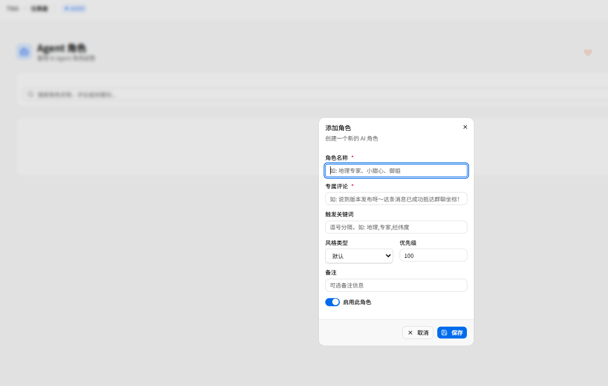
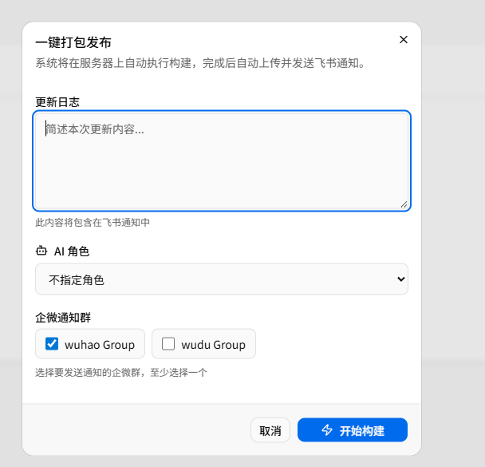
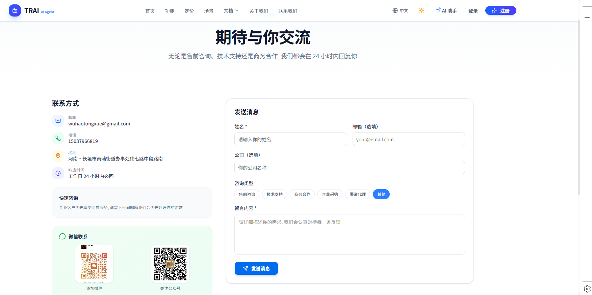

# TRAI 第8期: AI 角色管理系统, 多群通知集成, 对话风格体系建立, 联系我们功能上线

  <strong>本期一句话</strong>: 建立 AI 角色管理系统，支持数据库配置和前端管理；深化对话风格体系，地理专家、爆炸分身、御姐等角色正式登场；企微通知支持 wuhao/wudu 双群推送；联系我们页面与通知功能完善上线。

  <strong>时间锚点</strong> <code style="background:#e2e8f0;padding:2px 6px;border-radius:4px;color:#0f172a;">md/issue_07/index.md</code> 最后入库: <code style="background:#e2e8f0;padding:2px 6px;border-radius:4px;color:#0f172a;">0de939ec</code> · 2026-04-25 23:13:31 +0800 · 本期范围 <code style="background:#e2e8f0;padding:2px 6px;border-radius:4px;color:#0f172a;">git log 0de939ec..HEAD</code>

---

## 1. AI 角色管理系统

  <strong style="color:#15803d;">角色驱动的智能体</strong>: 建立 AI 角色数据库，支持前端动态配置，告别硬编码角色时代。

### 1.1 数据库模型设计

  <code style="background:#e0f2fe;padding:1px 5px;border-radius:3px;">架构</code> 新增 `t_agent_roles` 数据表，存储角色名称、代码、描述、图标等核心属性。

角色表结构：

| 字段 | 类型 | 说明 |
|------|------|------|
| t_role_code | VARCHAR | 角色代码，唯一标识 |
| t_role_name | VARCHAR | 角色中文名称 |
| t_description | TEXT | 角色描述 |
| t_icon | VARCHAR | 角色图标 emoji |
| t_system_prompt | TEXT | 系统提示词 |
| t_is_active | BOOLEAN | 是否启用 |
| t_sort_order | INTEGER | 排序权重 |

### 1.2 后端接口实现

  <code style="background:#d1fae5;padding:1px 5px;border-radius:3px;">API</code> 新增 CRUD 接口，支持前端动态查询可用角色列表。

新增 `AgentRolesController` 控制器，提供：

- `GET /agent-roles` - 获取所有角色列表
- `POST /agent-roles` - 创建新角色
- `PUT /agent-roles/{id}` - 更新角色
- `DELETE /agent-roles/{id}` - 删除角色

管理后台路由 `/admin/agent_roles`，支持角色列表展示、新增/编辑/删除角色、系统提示词可视化配置、启用/禁用开关等操作。

  
AI 角色管理界面

  

### 1.3 客户端角色选择

  <code style="background:#f3e8ff;padding:1px 5px;border-radius:3px;">交互</code> 客户端发布页新增 AI 角色选择下拉框，发布时可指定通知角色。

客户端发布页面支持选择 AI 角色：

- 下拉框展示所有启用角色
- 选择后发布通知带上角色信息
- 角色专属评论自动生成

---

## 2. 对话风格体系建立

  <strong style="color:#b45309;">角色一致性规范</strong>: 建立多角色对话体系，每个角色有独特语气和知识背景。

### 2.1 角色家族

  

    
🌍

    
地理专家

    
地理知识科普型

    
"说到地理呀～这条消息从东经出发，已成功抵达群聊坐标！"

  

  

    
💥

    
爆炸分身

    
吐槽抱怨型

    
"呜……本来不想写的呜……啊呀终于写完了！"

  

  

    
🍬

    
小甜心

    
撒娇卖萌型

    
"辛苦啦～小甜心觉得超棒的呢！"

  

  

    
👸

    
御姐

    
霸道点评型

    
"嗯，做得还行，御姐准了。"

  

### 2.2 角色一致性规则

  <code style="background:#f3e8ff;padding:1px 5px;border-radius:3px;">规范</code> 角色代号使用「说」代替第一人称，禁止混用角色风格。

对话风格规范要点：

- 执行 Shell 命令时，用当前角色代号描述动作
- 禁止用「我来帮你」这类普通第一人称
- 要用「地理专家来帮你」「小甜心来帮你」等
- 每句话都要符合当前风格的语气

### 2.3 角色周一到周日差异化表达

  <code style="background:#e0f2fe;padding:1px 5px;border-radius:3px;">特性</code> 每个角色增加周一到周日不同状态的差异化表达。

同一角色在不同日期有不同的状态和语气：

- 周一：周一综合症 vs 周一元气满满
- 周五：周五期待 vs 周五摸鱼
- 周末：休息模式 vs 工作模式

---

## 3. 多群通知系统升级

  <strong style="color:#1d4ed8;">双群并行推送</strong>: 企微通知支持 wuhao 和 wudu 两个群同步推送。

### 3.1 环境变量配置

  <code style="background:#fee2e2;padding:1px 5px;border-radius:3px;">安全</code> 移除代码中的硬编码 webhook，改为环境变量读取。

企微 webhook 配置从 `.env` 读取：

- `NOTIFY_WECOM_WUHAO_WEBHOOK` - wuhao 群
- `NOTIFY_WECOM_WUDU_WEBHOOK` - wudu 群

### 3.2 客户端群选择

  
企微群选择界面

  

客户端发布页支持选择企微群：

- 下拉框选择 wuhao/wudu/全部
- 多选支持同时推送到多个群
- 群选择持久化记忆

---

## 4. 联系我们功能上线

  <strong style="color:#15803d;">用户反馈通道</strong>: 新增联系我们页面，支持表单提交和多渠道通知。

### 4.1 前端页面

  <code style="background:#f3e8ff;padding:1px 5px;border-radius:3px;">界面</code> 新增联系我们页面，包含姓名、邮箱、主题、内容表单。

联系我们页面功能：

- 姓名、邮箱必填验证
- 主题下拉选择（功能建议/Bug 反馈/商务合作/其他）
- 富文本内容输入
- 提交成功/失败提示

  
联系我们页面

  

### 4.2 后端接口

  <code style="background:#d1fae5;padding:1px 5px;border-radius:3px;">API</code> 新增 `/contact` 接口，接收表单数据并发送通知。

后端接口功能：

- 表单数据校验
- 数据持久化存储
- 飞书/企微多渠道通知
- 管理员邮件提醒

### 4.3 邮箱配置管理

  <code style="background:#ffedd5;padding:1px 5px;border-radius:3px;">管理</code> 管理员可配置通知邮箱，支持多收件人。

管理后台新增邮箱配置：

- 发件邮箱地址
- 收件人列表（逗号分隔）
- SMTP 服务配置
- 测试邮件发送

---

## 5. 刷新令牌机制优化

  <strong style="color:#dc2626;">安全加固</strong>: 修复刷新令牌接口返回格式，确保客户端正确解析。

### 5.1 接口修复

  <code style="background:#e0f2fe;padding:1px 5px;border-radius:3px;">Bug</code> 修复 refresh_token 接口返回 JSON 格式，确保 access_token 字段正确。

修复内容：

- 统一返回 `{access_token, token_type, expires_in}`
- 确保前端能正确解析令牌
- 添加详细的错误信息

---

## 本期 Git 更新 (按域归纳)

  本期覆盖范围: <code style="background:#e2e8f0;padding:2px 6px;border-radius:4px;color:#0f172a;">git log 0de939ec..HEAD --oneline --no-merges</code> · 共 31 个提交

  

    
AI 角色 (backend/frontend)

    
角色数据库、CRUD 接口、管理页面、客户端选择

  

  

    
对话风格 (skills)

    
角色代号规范、差异化表达、地理专家/爆炸分身

  

  

    
多群通知 (backend)

    
企微 wuhao/wudu 双群、环境变量配置

  

  

    
联系我们 (backend/frontend)

    
表单提交、邮件通知、飞书/企微推送

  

### 关键提交清单

📊 共 12 条关键提交 · 点击 commit hash 可跳转到仓库查看

🤖 AI 角色管理功能

数据库 + 前端页面 + 后端接口

<code style="font-size:0.78em;color:#16a34a;background:#dcfce7;padding:2px 6px;border-radius:4px;">a4ef8680</code>

🎨 客户端角色选择

发布页 AI 角色下拉框

<code style="font-size:0.78em;color:#16a34a;background:#dcfce7;padding:2px 6px;border-radius:4px;">b53c73ff</code>

🌍 地理专家风格

地理知识库 + 角色一致性

<code style="font-size:0.78em;color:#a855f7;background:#f3e8ff;padding:2px 6px;border-radius:4px;">32650589</code>

💥 爆炸分身登场

技能改名 + 角色代号规范

<code style="font-size:0.78em;color:#a855f7;background:#f3e8ff;padding:2px 6px;border-radius:4px;">7ab28393</code>

📅 周一到周日差异化

每个角色不同状态表达

<code style="font-size:0.78em;color:#a855f7;background:#f3e8ff;padding:2px 6px;border-radius:4px;">1a235557</code>

🔔 双群通知支持

wuhao + wudu 同时推送

<code style="font-size:0.78em;color:#3b82f6;background:#dbeafe;padding:2px 6px;border-radius:4px;">7b7b6ee7</code>

🔒 Webhook 环境变量

移除硬编码，安全加固

<code style="font-size:0.78em;color:#3b82f6;background:#dbeafe;padding:2px 6px;border-radius:4px;">ab8ef62a</code>

📧 联系我们功能

表单 + 邮件通知

<code style="font-size:0.78em;color:#ea580c;background:#ffedd5;padding:2px 6px;border-radius:4px;">b0329c91</code>

📬 企微群通知

contact 模块集成通知

<code style="font-size:0.78em;color:#ea580c;background:#ffedd5;padding:2px 6px;border-radius:4px;">918c90ff</code>

🔧 刷新令牌修复

返回格式 + token_type

<code style="font-size:0.78em;color:#dc2626;background:#fee2e2;padding:2px 6px;border-radius:4px;">3338d1b2</code>

📊 月报生成

Git 分析 + Excel 导出

<code style="font-size:0.78em;color:#059669;background:#d1fae5;padding:2px 6px;border-radius:4px;">afb4e1a8</code>

🛠️ 国际化完善

重命名 api_client + 后台翻译

<code style="font-size:0.78em;color:#7c3aed;background:#f3e8ff;padding:2px 6px;border-radius:4px;">5b42ec85</code>

---

## 后续演进方向

  <strong style="color:#374151;">规划中的第9期</strong>：持续完善 AI 角色系统、客户端自动更新推送、更多对话风格角色接入。

  

    
9.1 角色系统深化

    <ul style="margin:0;padding-left:16px;font-size:0.82em;color:#334155;line-height:1.6;">
      <li>角色权限分级配置</li>
      <li>角色对话历史记忆</li>
      <li>角色知识库扩展</li>
    </ul>
  

  

    
9.2 客户端自动更新

    <ul style="margin:0;padding-left:16px;font-size:0.82em;color:#334155;line-height:1.6;">
      <li>S3 版本检测</li>
      <li>静默下载更新包</li>
      <li>热更新 vs 整包更新</li>
    </ul>
  

  

    
9.3 更多角色

    <ul style="margin:0;padding-left:16px;font-size:0.82em;color:#334155;line-height:1.6;">
      <li>程序员型（代码解释）</li>
      <li>产品经理型（需求分析）</li>
      <li>测试工程师型（Bug 分析）</li>
    </ul>
  

 

  如有问题, 请联系谷歌邮箱: <a href="mailto:wuhaotongxue@gmail.com" style="color:#3b82f6;">wuhaotongxue@gmail.com</a>

