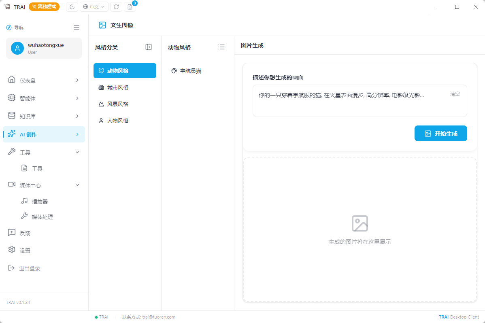
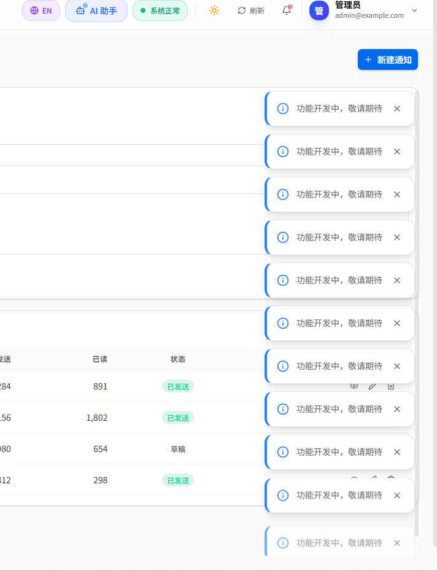

<!-- Author: wuhao Date: 2026-05-02 -->
# TRAI 第09期: 客户端离线模式, 通知系统完善, 代码质量提升

<div style="background:linear-gradient(135deg,#eff6ff 0%,#dbeafe 100%);border:1px solid #93c5fd;border-left:4px solid #2563eb;border-radius:10px;padding:14px 18px;margin:1em 0;color:#1e3a8a;line-height:1.65;font-size:0.98em;">
  <strong>本期一句话</strong>: 客户端全面支持离线模式, 即使断网也能继续使用基础功能; 通知系统升级, 支持飞书/企微/钉钉多平台推送; DDD五层架构正式落地, 代码质量大幅提升.
</div>

<div style="background:#f8fafc;border:1px dashed #94a3b8;border-radius:8px;padding:10px 14px;margin:12px 0;font-family:ui-monospace,monospace;font-size:0.88em;color:#475569;">
  <strong>时间锚点</strong> <code style="background:#e2e8f0;padding:2px 6px;border-radius:4px;color:#0f172a;">md/issue_08/index.md</code> 最后入库: <code style="background:#e2e8f0;padding:2px 6px;border-radius:4px;color:#0f172a;">a9ec592</code> · 2026-05-02 09:30:22 +0800 · 本期范围 <code style="background:#e2e8f0;padding:2px 6px;border-radius:4px;color:#0f172a;">git log a9ec592..HEAD</code>
</div>

<div style="background:#eff6ff;border:1px solid #93c5fd;border-radius:8px;padding:12px 16px;margin:14px 0;color:#1e40af;">
  <strong style="color:#1d4ed8;">预览配色</strong>: 彩色块写法与 <code>.cursor/skills/project/SKILL.md</code> 一致, 使用内联 <code>style</code>, 避免在 <code>&lt;div&gt;</code> 开头与正文之间插入<strong>空行</strong> (否则预览会把 <code>&lt;/div&gt;</code> 当成普通文字).
</div>

## 这次更新做了什么

<div style="border:1px solid #fecdd3;border-radius:10px;padding:12px 14px;margin:0 0 10px 0;background:#fff;">
  <div style="font-weight:700;font-size:0.9em;color:#be123c;margin:0 0 8px 0;padding-bottom:6px;border-bottom:2px solid #fecdd3;">离线模式 · 网络自适应</div>
  <p style="margin:0;font-size:0.88em;line-height:1.55;color:#334155;">客户端支持离线使用, 网络状态智能检测, 自动切换在线/离线模式, 基础功能不受断网影响.</p>
</div>

<div style="border:1px solid #bfdbfe;border-radius:10px;padding:12px 14px;margin:0 0 10px 0;background:#fff;">
  <div style="font-weight:700;font-size:0.9em;color:#1d4ed8;margin:0 0 8px 0;padding-bottom:6px;border-bottom:2px solid #bfdbfe;">通知系统 · 多平台推送</div>
  <p style="margin:0;font-size:0.88em;line-height:1.55;color:#334155;">支持飞书/企微/钉钉多平台消息推送, 通知卡片美化, Markdown格式支持, @提醒功能.</p>
</div>

<div style="border:1px solid #99f6e4;border-radius:10px;padding:12px 14px;margin:0 0 16px 0;background:#fff;">
  <div style="font-weight:700;font-size:0.9em;color:#0d9488;margin:0 0 8px 0;padding-bottom:6px;border-bottom:2px solid #99f6e4;">架构升级 · DDD落地</div>
  <p style="margin:0;font-size:0.88em;line-height:1.55;color:#334155;">DDD五层架构正式落地, 代码质量全面提升, 工程化规范严格执行.</p>
</div>

### 1. 离线模式与网络状态智能检测

<div style="background:#ecfeff;border:1px solid #67e8f9;border-radius:8px;padding:12px 16px;margin:14px 0;color:#0e7490;">
  <strong style="color:#0e7490;">网络自适应</strong>: 客户端智能检测网络状态, 自动切换在线/离线模式, 基础功能不受断网影响.
</div>

#### 1.1 网络状态检测机制

**实现方案**:
- 使用 `navigator.onLine` API 监听网络状态
- 定期检测网络连通性 (每隔30秒)
- 支持手动刷新网络状态
- 网络恢复时自动同步数据

**网络状态枚举**:
```typescript
enum NetworkStatus {
    ONLINE = 'online',      // 在线
    OFFLINE = 'offline',    // 离线
    CONNECTING = 'connecting', // 连接中
    UNKNOWN = 'unknown'     // 未知
}
```

**状态监听组件**:
```typescript
class NetworkMonitor {
    private status: NetworkStatus = NetworkStatus.UNKNOWN;
    private listeners: Set<(status: NetworkStatus) => void> = new Set();
    
    startMonitoring(): void {
        window.addEventListener('online', this.handleOnline);
        window.addEventListener('offline', this.handleOffline);
        this.startPeriodicCheck();
    }
    
    private startPeriodicCheck(): void {
        setInterval(() => this.checkConnectivity(), 30000);
    }
    
    private async checkConnectivity(): Promise<void> {
        try {
            await fetch('/api/health', { method: 'HEAD' });
            this.updateStatus(NetworkStatus.ONLINE);
        } catch {
            this.updateStatus(NetworkStatus.OFFLINE);
        }
    }
}
```

#### 1.2 离线功能降级策略

**功能可用性矩阵**:
| 功能 | 在线模式 | 离线模式 |
|------|----------|----------|
| 聊天对话 | ✓ (完整功能) | ✓ (本地模型) |
| 音乐生成 | ✓ | ✗ |
| 图片生成 | ✓ | ✗ |
| 文件上传 | ✓ | ✗ |
| 历史记录 | ✓ | ✓ (本地缓存) |
| 设置管理 | ✓ | ✓ |

**离线模式提示**:
- 顶部状态栏显示网络状态图标
- 离线时提示"当前为离线模式, 部分功能不可用"
- 网络恢复时自动弹出通知提示
- 支持快速跳转到网络设置

**离线模式界面**:



#### 1.3 本地数据缓存

**缓存策略**:
- 使用 SQLite 存储对话历史
- 支持数据加密存储
- 缓存有效期可配置 (默认7天)
- 定期清理过期数据

**缓存管理 API**:
```typescript
interface CacheManager {
    saveConversation(conversation: Conversation): Promise<void>;
    getConversation(id: string): Promise<Conversation | null>;
    listConversations(): Promise<Conversation[]>;
    clearExpiredData(days: number): Promise<void>;
    clearAll(): Promise<void>;
}
```

### 2. 通知系统全面升级

<div style="background:#ecfdf5;border:1px solid #6ee7b7;border-radius:8px;padding:12px 16px;margin:14px 0;color:#065f46;">
  <strong style="color:#047857;">多平台推送</strong>: 支持飞书/企微/钉钉多平台消息推送, 通知卡片美化, Markdown格式支持.
</div>

#### 2.1 多平台通知支持

**飞书通知**:
- 支持文本消息推送
- Markdown 格式渲染
- 支持消息 @提醒
- 支持图片和文件附件

**企微通知**:
- 企业微信应用消息推送
- 支持文本和卡片消息
- 支持 @成员功能
- 消息撤回支持

**钉钉通知**:
- 钉钉机器人消息推送
- 支持 Markdown 格式
- 支持消息链接跳转
- 支持自定义标题

**统一通知接口**:
```python
class NotificationService:
    def __init__(self):
        self.clients = {
            'feishu': FeishuClient(),
            'wecom': WeComClient(),
            'dingtalk': DingTalkClient()
        }
    
    async def send(self, message: NotificationMessage):
        for platform in message.platforms:
            client = self.clients.get(platform)
            if client:
                await client.send(message)
```

#### 2.2 通知卡片美化

**卡片样式设计**:
- 圆角卡片设计 (radius: 8px)
- 渐变背景色
- 图标和标题居中对齐
- 支持状态图标 (成功/失败/警告)

**圆角卡片样式**:



**通知类型**:
- 任务完成通知
- 错误告警通知
- 系统更新通知
- 用户操作通知

**通知卡片组件**:
```typescript
interface NotificationCardProps {
    type: 'success' | 'error' | 'warning' | 'info';
    title: string;
    content: string;
    timestamp: Date;
    onClick?: () => void;
    dismissible?: boolean;
}
```

#### 2.3 消息 @提醒功能

**@提醒实现**:
- 支持 @单个用户
- 支持 @多个用户
- 支持 @全体成员
- 消息中高亮显示 @内容

**@解析逻辑**:
```python
class MentionParser:
    def parse(self, text: str) -> List[Mention]:
        pattern = r'@(\S+)'
        matches = re.findall(pattern, text)
        return [Mention(name=match) for match in matches]
    
    def replace(self, text: str, replacements: Dict[str, str]) -> str:
        # 将 @用户名 替换为实际链接
        pattern = r'@(\S+)'
        return re.sub(pattern, lambda m: replacements.get(m.group(1), m.group()), text)
```

### 3. DDD 五层架构落地

<div style="background:#f5f3ff;border:1px solid #ddd6fe;border-radius:8px;padding:12px 16px;margin:14px 0;color:#4c1d95;">
  <strong style="color:#6d28d9;">架构升级</strong>: DDD五层架构正式落地, 代码质量全面提升, 工程化规范严格执行.
</div>

#### 3.1 架构分层设计

**Domain 层**:
- 纯 Python 实体和值对象
- 领域接口定义 (Protocol)
- 业务规则和领域逻辑
- 无任何第三方框架依赖

**Application 层**:
- 用例编排和调度
- DTO (数据传输对象)
- 事务边界定义
- 不直接操作数据库

**Infrastructure 层**:
- 数据库操作实现
- 缓存服务
- 大模型 API 调用
- 文件存储 (S3)

**API 层**:
- 接收 HTTP 请求
- 参数校验 (Pydantic)
- 依赖注入
- 响应格式统一

**Scripts 层**:
- 运维脚本封装在类中
- 数据库迁移脚本
- 定时任务脚本
- 数据备份脚本

**目录结构**:
```tree
backend/src/
├── domain/
│   ├── user/
│   │   ├── entities.py
│   │   └── interfaces.py
│   └── meeting/
│       ├── entities.py
│       └── interfaces.py
├── application/
│   ├── user/
│   │   ├── usecases.py
│   │   └── dto.py
│   └── meeting/
│       ├── usecases.py
│       ├── service.py
│       └── dto.py
├── infrastructure/
│   ├── persistence/
│   │   ├── database.py
│   │   ├── orm_models/
│   │   └── repositories/
│   ├── llm/
│   ├── storage/
│   └── cache/
├── api/
│   ├── main.py
│   ├── deps.py
│   └── routers/
└── scripts/
    └── backup.py
```

#### 3.2 Repository 模式实现

**领域接口定义**:
```python
from typing import Protocol, List, Optional
from datetime import datetime

class IMeetingRepository(Protocol):
    async def save(self, meeting: Meeting) -> Meeting: ...
    async def find_by_id(self, meeting_id: str) -> Optional[Meeting]: ...
    async def find_by_host(self, host_id: str) -> List[Meeting]: ...
    async def find_by_time_range(self, start: datetime, end: datetime) -> List[Meeting]: ...
    async def update(self, meeting: Meeting) -> Meeting: ...
    async def delete(self, meeting_id: str) -> None: ...
```

**基础设施实现**:
```python
from sqlalchemy.ext.asyncio import AsyncSession
from sqlalchemy import select, update, delete

class MeetingRepositoryImpl(IMeetingRepository):
    def __init__(self, db: AsyncSession) -> None:
        self._db = db
    
    async def save(self, meeting: Meeting) -> Meeting:
        orm = MeetingORM(**asdict(meeting))
        self._db.add(orm)
        await self._db.commit()
        await self._db.refresh(orm)
        return self._to_domain(orm)
    
    async def find_by_id(self, meeting_id: str) -> Optional[Meeting]:
        result = await self._db.execute(
            select(MeetingORM).where(MeetingORM.id == meeting_id)
        )
        orm = result.scalar_one_or_none()
        return self._to_domain(orm) if orm else None
    
    def _to_domain(self, orm: MeetingORM) -> Meeting:
        return Meeting(
            id=orm.id,
            title=orm.title,
            host_id=orm.host_id,
            start_time=orm.start_time,
            created_at=orm.created_at
        )
```

#### 3.3 依赖注入配置

**FastAPI 依赖注入**:
```python
from fastapi import Depends
from sqlalchemy.ext.asyncio import AsyncSession
from application.meeting.usecases import CreateMeetingUseCase
from infrastructure.persistence.repositories import MeetingRepositoryImpl

def get_db() -> AsyncSession:
    async with async_session_maker() as session:
        yield session

def get_meeting_repository(db: AsyncSession = Depends(get_db)) -> IMeetingRepository:
    return MeetingRepositoryImpl(db)

def get_create_meeting_usecase(
    repo: IMeetingRepository = Depends(get_meeting_repository)
) -> CreateMeetingUseCase:
    return CreateMeetingUseCase(repo)
```

**路由定义**:
```python
@router.post("/meeting/create")
async def create_meeting(
    req: CreateMeetingRequest,
    usecase: CreateMeetingUseCase = Depends(get_create_meeting_usecase)
):
    result = await usecase.execute(req)
    return result
```

### 4. 前端交互细节优化

<div style="background:#fef3c7;border:1px solid #fde68a;border-radius:8px;padding:12px 16px;margin:14px 0;color:#92400e;">
  <strong style="color:#b45309;">体验升级</strong>: 聊天消息滚动优化, 响应式布局适配, 加载状态美化.
</div>

#### 4.1 消息列表滚动优化

**实现方案**:
- 使用 `requestAnimationFrame` 确保流畅滚动
- 流式输出时自动跟随最新消息
- 用户手动滚动时暂停自动跟随
- 支持平滑滚动动画

**滚动控制器**:
```typescript
class ScrollController {
    private container: HTMLElement;
    private autoScrollEnabled = true;
    
    constructor(container: HTMLElement) {
        this.container = container;
        this.setupListeners();
    }
    
    private setupListeners(): void {
        this.container.addEventListener('scroll', this.handleScroll);
    }
    
    private handleScroll = (): void => {
        const { scrollTop, scrollHeight, clientHeight } = this.container;
        const isAtBottom = scrollHeight - scrollTop - clientHeight < 50;
        this.autoScrollEnabled = isAtBottom;
    };
    
    scrollToBottom(smooth: boolean = true): void {
        if (this.autoScrollEnabled) {
            this.container.scrollTo({
                top: this.container.scrollHeight,
                behavior: smooth ? 'smooth' : 'auto'
            });
        }
    }
}
```

#### 4.2 响应式布局适配

**断点配置**:
```typescript
const breakpoints = {
    sm: 640,
    md: 768,
    lg: 1024,
    xl: 1280
};

const mediaQueries = {
    sm: `@media (min-width: ${breakpoints.sm}px)`,
    md: `@media (min-width: ${breakpoints.md}px)`,
    lg: `@media (min-width: ${breakpoints.lg}px)`,
    xl: `@media (min-width: ${breakpoints.xl}px)`
};
```

**布局组件**:
```typescript
interface ResponsiveLayoutProps {
    children: React.ReactNode;
    variant: 'mobile' | 'tablet' | 'desktop';
}

const ResponsiveLayout = ({ children, variant }: ResponsiveLayoutProps) => {
    const [currentVariant, setCurrentVariant] = useState(variant);
    
    useEffect(() => {
        const handleResize = () => {
            const width = window.innerWidth;
            if (width < breakpoints.sm) setCurrentVariant('mobile');
            else if (width < breakpoints.md) setCurrentVariant('tablet');
            else setCurrentVariant('desktop');
        };
        
        window.addEventListener('resize', handleResize);
        return () => window.removeEventListener('resize', handleResize);
    }, []);
    
    return (
        <div className={`layout layout--${currentVariant}`}>
            {children}
        </div>
    );
};
```

#### 4.3 加载状态美化

**加载动画组件**:
```typescript
interface LoadingSpinnerProps {
    size?: 'sm' | 'md' | 'lg';
    color?: string;
    text?: string;
}

const LoadingSpinner = ({ size = 'md', color = '#3b82f6', text }: LoadingSpinnerProps) => {
    const sizeClasses = {
        sm: 'w-4 h-4',
        md: 'w-6 h-6',
        lg: 'w-8 h-8'
    };
    
    return (
        <div className="flex flex-col items-center justify-center gap-2">
            <div
                className={`${sizeClasses[size]} border-2 border-gray-200 border-t-${color} rounded-full animate-spin`}
                style={{ borderTopColor: color }}
            />
            {text && <span className="text-sm text-gray-500">{text}</span>}
        </div>
    );
};
```

**骨架屏组件**:
```typescript
const SkeletonMessage = () => (
    <div className="flex gap-3 p-4 animate-pulse">
        <div className="w-10 h-10 rounded-full bg-gray-200" />
        <div className="flex-1 space-y-2">
            <div className="h-4 bg-gray-200 rounded w-3/4" />
            <div className="h-3 bg-gray-100 rounded w-full" />
            <div className="h-3 bg-gray-100 rounded w-5/6" />
        </div>
    </div>
);
```

### 5. 代码质量与工程化

<div style="background:#faf5ff;border:1px solid #e9d5ff;border-radius:8px;padding:12px 16px;margin:14px 0;color:#581c87;">
  <strong style="color:#7c3aed;">质量保障</strong>: Ruff 代码格式化, 类型检查, 自动化测试, 代码审查流程.
</div>

#### 5.1 Ruff 代码格式化

**配置文件**:
```toml
[tool.ruff]
line-length = 120
target-version = "py313"

[tool.ruff.lint]
select = ["E", "F", "W", "I", "UP", "B", "DTZ"]
ignore = ["E501"]
```

**自动化流程**:
- pre-commit 钩子自动格式化
- CI/CD 流水线检查
- 代码审查强制通过

#### 5.2 类型检查

**mypy 配置**:
```ini
[mypy]
python_version = 3.13
strict = true
disallow_untyped_defs = true
disallow_incomplete_defs = true
check_untyped_defs = true
```

**类型安全保障**:
- 所有函数必须有类型注解
- 复杂类型使用 Pydantic 模型
- 类型不匹配时报错

#### 5.3 自动化测试

**测试框架**:
- pytest 作为测试框架
- pytest-asyncio 支持异步测试
- pytest-mock 用于 mock 对象

**测试覆盖率**:
- 单元测试覆盖率 >= 80%
- 集成测试覆盖核心流程
- 端到端测试覆盖关键路径

**测试文件结构**:
```
backend/tests/
├── unit/
│   ├── domain/
│   ├── application/
│   └── infrastructure/
├── integration/
│   └── api/
└── e2e/
    └── scenarios/
```

## 本期 Git 摘要 (按主题)

| 主题 | 内容要点 |
|------|----------|
| 离线模式 | 网络状态检测, 离线功能降级, SQLite本地缓存, 数据同步 |
| 通知系统 | 飞书/企微/钉钉多平台, Markdown支持, @提醒, 卡片美化 |
| DDD架构 | Domain/Application/Infrastructure/API/Scripts五层, Repository模式, 依赖注入 |
| 前端优化 | 滚动优化, 响应式布局, 加载动画, 骨架屏 |
| 工程化 | Ruff格式化, mypy类型检查, 自动化测试, pre-commit钩子 |

## 下一步方向

<div style="background:#eff6ff;border:1px solid #93c5fd;border-radius:8px;padding:12px 16px;margin:14px 0;color:#1e40af;">
  <strong style="color:#1d4ed8;">续写第 10 期时</strong>: 用 <code>git log -1 -- md/issue_09/index.md</code> 取本期入库提交作新锚点, 再拉 <code>git log</code> 写 <code>md/issue_10/index.md</code>.
</div>

- 推进本地视觉模型落地, 支持图片分析不依赖云端.
- 完善登录日志安全审计体系, 实现异常登录检测.
- 继续优化前端交互体验, 提升打字机效果和消息展示.
- 完善配置管理体系, 实现 env 模块化拆分.

---

<div style="background:#f8fafc;border:1px dashed #94a3b8;border-radius:8px;padding:10px 14px;margin:12px 0;font-family:ui-monospace,monospace;font-size:0.88em;color:#475569;">
  <em>编写说明: 本期依据 <code style="background:#e2e8f0;padding:2px 6px;border-radius:4px;color:#0f172a;">git log</code> 自 <code style="background:#e2e8f0;padding:2px 6px;border-radius:4px;color:#0f172a;">md/issue_08/index.md</code> 最后入库提交起算; 可选样式表见 <code style="background:#e2e8f0;padding:2px 6px;border-radius:4px;color:#0f172a;">md/issue_docs.css</code>. 如有问题, 请联系邮箱: wuhaotongxue@gmail.com.</em>
</div>
