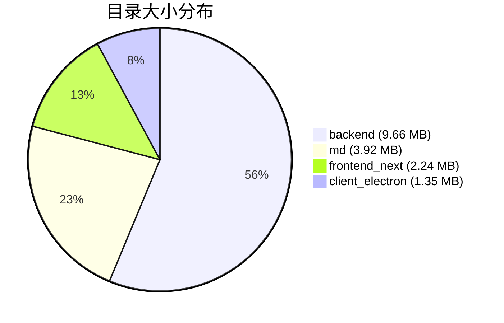

# 仓库大小统计报告

---

## 📊 整体统计

| 指标 | 值 |
|------|-----|
| Git Pack 大小 | 156 MB |
| 工作目录总大小 | 19.6 MB |

## 📁 目录大小排行

| 目录 | 大小 | 占比 |
|------|------|------|
| `backend` | 9.66 MB | 49.3% |
| `md` | 3.92 MB | 20.0% |
| `frontend_next` | 2.24 MB | 11.4% |
| `client_electron` | 1.35 MB | 6.9% |
| `.cursor` | 0.69 MB | 3.5% |
| `.trae` | 0.65 MB | 3.3% |
| `docs` | 0.02 MB | 0.1% |
| `styles` | 0.01 MB | 0.1% |

## 📦 大文件列表（>500KB）

| 文件路径 | 大小 | 说明 |
|----------|------|------|
| `backend/assets/pdf_vendor/mermaid.min.js` | 3.18 MB | PDF 渲染库 |
| `md/issue_07/index.pdf` | 1.11 MB | 文档 |
| `backend/acestep_lib/assets/ACE-Step_framework.png` | 1.08 MB | 框架图示 |
| `backend/acestep_lib/assets/demo_interface.png` | 0.62 MB | 演示界面截图 |

## 📈 大小分布饼图

## 🔍 详细分析

### 最大目录：backend (9.66 MB)

| 子目录 | 大小 |
|--------|------|
| `assets` | 3.47 MB |
| `acestep_lib` | 2.13 MB |
| `src` | 1.92 MB |
| `env` / `env_example` | 0.13 MB 各 |

### 已清理的大文件（节省空间）

| 文件 | 大小 | 类型 |
|------|------|------|
| `train_demo.gif` | 9.0 MB | 演示动画 |
| `zh_lora_dataset/data-00000-of-00001.arrow` | 7.0 MB | 训练数据集 |
| `audio2audio_demo.gif` | 0.62 MB | 演示动画 |
| `acestep_tech_report.pdf` | 0.48 MB | 技术文档 |
| `rap_machine_demo.gif` | 0.18 MB | 演示动画 |
| **总计** | **~17 MB** | |

---

> 生成时间: 2026-06-01 10:00:00
